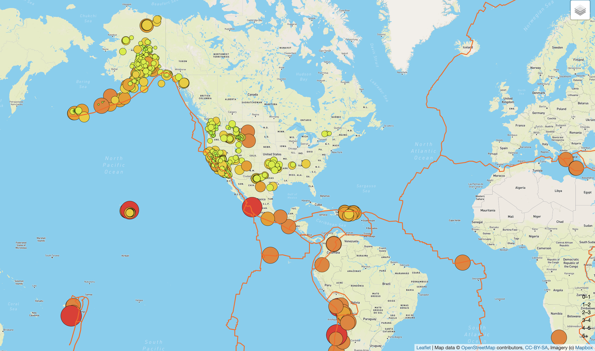
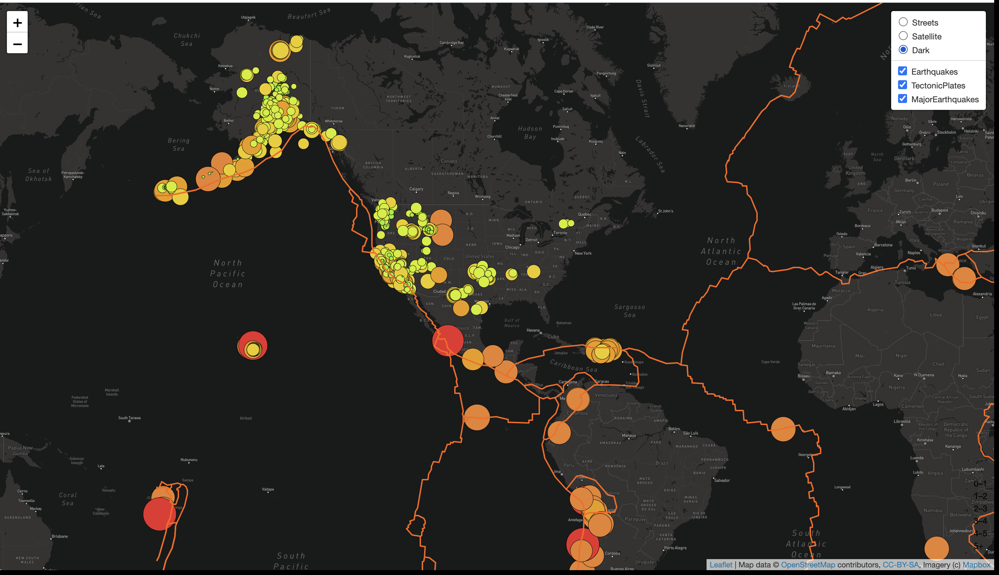

# Mapping Earthquakes

## OVERVIEW 

The objective of this challenge was to display GeoJSON seismic data on a map using the Leaflet.js Application Programming Interface (API). Each earthquake is represented by a circle with a different colors and size to show the magnitud of the quake. The larger the diameter and the darker the color, the more powerful the quake. It is also possible to see the magnitude and position of an earthquake by clicking on any circle and reading the earthquake's pop-up marker.

The final map shows the following:

1. The earthquake data and tectonic plate data 
2. The earthquake and tectonic plate data are displayed when the page loads and the datasets can be toggled on or off
3. All the earthquake data and tectonic plate data are displayed on the all maps of the webpage

### SUMMARY

**Streets Layer**

**Satellite Layer**

**Dark Layer**

## Resources

**Data Source:** JSON, API's

**Software:** JavaScript, Bootstrap